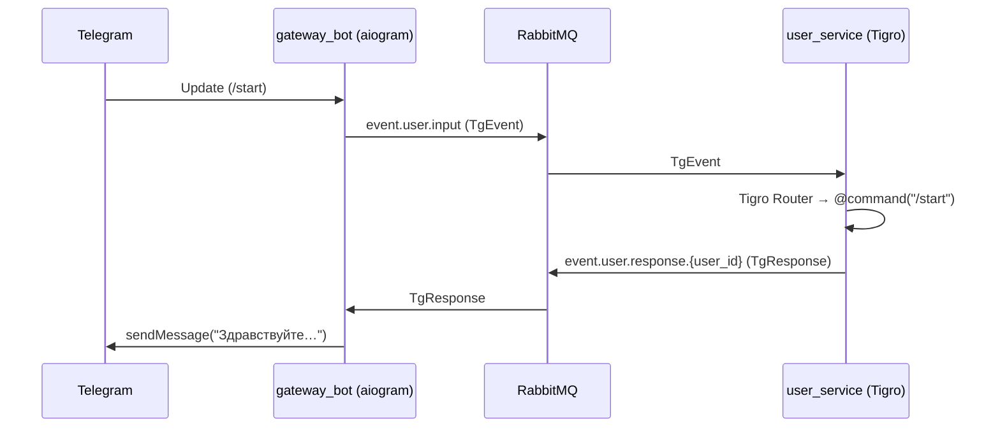

# 🐯 Tigro — как встроить библиотеку в микросервисную экосистему Telegram‑бота

Этот документ показывает **назначение Tigro**, общую архитектуру, а также минимальные примеры подключения **gateway‑bot** и микросервиса `user_service`.

---

## Зачем нужен Tigro

| Базовый бот | Бот с Tigro |
|-------------|-------------|
| Монолит владеет Telegram SDK и всей бизнес‑логикой | Telegram SDK живёт **только** в gateway‑bot; бизнес‑логика размазана по микросервисам, где хендлеры пишут так же, как в aiogram |
| Невозможно масштабировать отдельные функции | Каждый сервис масштабируется независимо |
| Любое падение валит весь бот | Сбой ограничен одним сервисом |

---

## Взаимодействие компонентов



### DTO-шаблоны (актуальные)

| `TgEvent` поле         | Тип                                   | Назначение                                                        |
|------------------------|---------------------------------------|-------------------------------------------------------------------|
| `user_id`              | int                                   | ID пользователя Telegram                                          |
| `chat_id`              | int                                   | ID чата                                                          |
| `message_id`           | Optional[int]                         | ID сообщения (если есть)                                          |
| `text`                 | Optional[str]                         | Текст сообщения (если есть)                                       |
| `callback_data`        | Optional[str]                         | Данные callback-кнопки (если есть)                                |
| `state`                | Optional[str]                         | FSM-состояние пользователя                                       |
| `event_type`           | Literal["message", "callback", "command"] | Тип события: обычное сообщение, callback или команда              |
| `metadata`             | Optional[Dict[str, Any]] (default: {{}}) | Служебные данные, любые дополнительные параметры                  |
| `correlation_id`       | Optional[str]                         | Для трассировки запросов между сервисами                          |

| `TgResponse` поле      | Тип                                   | Назначение                                                        |
|------------------------|---------------------------------------|-------------------------------------------------------------------|
| `action`               | Literal["send_message", "edit_message", "answer_callback", "none"] | Какое действие выполнить на стороне gateway-бота                  |
| `text`                 | Optional[str]                         | Текст сообщения/редактирования                                    |
| `next_state`           | Optional[str]                         | Новое FSM-состояние пользователя                                  |
| `markup`               | Optional[Dict[str, Any]]              | Клавиатура (inline/reply), в формате DSL Tigro                    |
| `metadata`             | Optional[Dict[str, Any]]              | Служебные данные (например, message_id, callback_id)              |
| `error`                | Optional[str]                         | Описание ошибки, если есть                                        |
| `correlation_id`       | Optional[str]                         | Для трассировки ответа                                            |
| `parse_mode`           | Optional[str]                         | Форматирование текста: "HTML", "Markdown" и др.                  |

> **Примечание:** Все поля Optional могут отсутствовать в конкретном событии/ответе. Поле `correlation_id` используется для сквозной трассировки запросов между сервисами и ответами.


---


---

## Поток данных шаг за шагом

1. **Пользователь** пишет `/start`  
2. **gateway_bot** сериализует сообщение в `TgEvent` и кладёт в RabbitMQ  
3. **user_service** получает `TgEvent`, Tigro находит `@command("/start")`, формирует `TgResponse` через `ctx.send_message()`  
4. Tigro публикует `TgResponse` в `event.user.response.{user_id}`  
5. **gateway_bot** исполняет API‑метод `sendMessage` и, при необходимости, меняет FSM‑состояние

---

## Быстрый чек‑лист подключения нового сервиса

1. `broker = RabbitBroker(...)`
2. `router = Router(publisher=RabbitPublisher(broker))`
3. Пишем хендлеры с декораторами `@command | @message | @callback`
4. Регистрируем их в Router
5. Подписываемся на `event.user.input`
6. Вызываем `await router.dispatch(TgEvent(**raw))`

---

Готово! Сервис обрабатывает Telegram‑события, не зная о Telegram API.

---

# 🏗️ Архитектура Tigro: слои, модули, расширяемость

## 📁 Структура каталогов

<details>
<summary><b>lib/tigro/</b> — корень библиотеки и сборки</summary>

├── <b>tigro/</b> — основной пакет библиотеки  
│   ├── <b>__init__.py</b> — инициализация пакета  
│   ├── <b>contracts.py</b> — абстрактные интерфейсы и протоколы (SOLID)  
│   ├── <b>core.py</b> — базовые реализации Router, Context, ResponseCollector  
│   ├── <b>schemas.py</b> — Pydantic-схемы событий и ответов (TgEvent, TgResponse)  
│   ├── <b>keyboard.py</b> — DSL для создания клавиатур  
│   ├── <b>decorators.py</b> — декораторы для регистрации хендлеров  
│   ├── <b>matchers.py</b> — реализации матчеров (команды, колбэки, условия)  
│   ├── <b>modules.py</b> — поддержка модульных роутеров  
│   ├── <b>discovery.py</b> — автоматическая регистрация хендлеров  
│   ├── <b>renderers/</b> — преобразование DSL клавиатур в объекты фреймворков  
│   │   └── <b>__init__.py</b> — рендереры для aiogram и др.  
│   ├── <b>transport/</b> — абстракции и реализации транспорта  
│   │   ├── <b>__init__.py</b>  
│   │   └── <b>rabbit_bus.py</b> — RabbitMQ publisher/subscriber  
│   └── <b>gateway/</b> — интеграция с Telegram-фреймворками  
│       ├── <b>__init__.py</b> — фабрика и реестр gateway  
│       ├── <b>base.py</b> — базовый интерфейс gateway  
│       ├── <b>aiogram_gateway.py</b> — реализация для aiogram  
│       └── <b>rpc.py</b> — RPC-клиент для сервисов  
│
├── <b>shared/</b> — (опционально) прокси для совместимости  
├── <b>tests/</b> — тесты библиотеки  
│   └── <b>test_router.py</b> — тесты роутера  
├── <b>README.md</b> — документация  
├── <b>Назначение библиотеки.md</b> — назначение и инструкция  
├── <b>pyproject.toml</b> — метаданные и зависимости  
├── <b>LICENSE</b> — лицензия  
└── <b>.gitignore</b> — игнорируемые файлы  
</details>

---

## 🧩 Основные компоненты и их назначение

- **contracts.py** — только абстракции (интерфейсы, Protocol, ABC)
- **core.py** — базовые реализации (Router, Context, ResponseCollector)
- **gateway/** — интеграция с Telegram-фреймворками (aiogram, telebot и др.)
- **transport/** — транспорт (RabbitMQ, HTTP и др.)
- **renderers/** — преобразование абстрактных клавиатур в объекты фреймворков
- **keyboard.py** — декларативный DSL для построения клавиатур
- **modules.py** — поддержка много-модульности (ModuleRouter)
- **decorators.py** — удобные декораторы для регистрации хендлеров
- **discovery.py** — автоматическая регистрация хендлеров
- **schemas.py** — только схемы данных (Pydantic)
- **tests/** — только тесты, без бизнес-логики

---

## 🧑‍💻 Принципы SOLID в Tigro

- **SRP**: Каждый модуль/класс отвечает только за одну зону ответственности.
- **OCP**: Для расширения — только новые классы/модули, не изменение существующих.
- **LSP**: Все абстракции взаимозаменяемы (Matcher, Handler, Gateway).
- **ISP**: Публичные интерфейсы максимально узкие.
- **DIP**: Высокоуровневые компоненты зависят только от абстракций.

---

## 🔍 Описание публичных методов и функций

### tigro.core
- **Router** — маршрутизатор событий
  - `register(matcher, handler)` — добавить правило
  - `dispatch(event)` — обработать событие (TgEvent)
- **Context** — формирует ответы
  - `send_message(text, markup=None, parse_mode="", **kwargs)` — отправить сообщение
  - `edit_message(text, markup=None, parse_mode="", message_id=None, **kwargs)` — отредактировать сообщение

### tigro.decorators
- `@command("/start")` — хендлер команды
- `@callback("data")` — хендлер callback-кнопки
- `@message(predicate)` — хендлер по произвольному условию

### tigro.keyboard
- `cb_btn(text, data)` — callback-кнопка
- `url_btn(text, url)` — кнопка-ссылка
- `inline_kb(*rows, row_width=None)` — inline-клавиатура
- `inline_kb_grid(*groups, cols=None)` — сетка клавиатур
- `reply_kb(*rows)` — обычная клавиатура

### tigro.modules
- **ModuleRouter** — группировка хендлеров
- `include_router(parent, child)` — объединить роутеры

### tigro.discovery
- `autodiscover(router)` — зарегистрировать все хендлеры текущего модуля

### tigro.gateway
- `run_gateway(token, broker_url, framework="aiogram")` — запустить gateway-бота с выбранным фреймворком
- `get_gateway_class(framework)` — получить класс gateway по имени

### tigro.schemas
- **TgEvent** — событие Telegram (user_id, chat_id, text, ...)
- **TgResponse** — ответ (action, text, markup, ...)

### tigro.transport
- **RabbitPublisher** — отправка сообщений через RabbitMQ

---

## 🛠️ Расширяемость и best practices

- **Добавить новый gateway**: реализовать класс в `gateway/`, зарегистрировать в `GATEWAY_REGISTRY`.
- **Добавить новый транспорт**: реализовать класс в `transport/`, использовать через абстракцию ResponsePublisher.
- **Добавить новый тип клавиатуры**: реализовать функцию в `keyboard.py` и рендерер в `renderers/`.
- **Добавить новые параметры сообщений**: расширить MessageCommand, не меняя Context.
- **Добавить middleware**: реализовать класс и передать в Router.

---

## ✨ Примеры использования

### Команды и колбэки
```python
@router.command("/start")
async def start(ctx: Context):
    await ctx.send_message("Привет!", markup=inline_kb(cb_btn("Помощь", "help")))

@router.callback("help")
async def help(ctx: Context):
    await ctx.edit_message("Это раздел помощи", parse_mode="Markdown")
```

### Клавиатуры
```python
keyboard = inline_kb(
    cb_btn("Кнопка 1", "cb1"),
    cb_btn("Кнопка 2", "cb2"),
    row_width=2
)
```

### Форматирование текста
```python
await ctx.send_message("<b>Жирный</b> и <i>курсив</i>", parse_mode="HTML")
await ctx.edit_message("*Жирный* и _курсив_", parse_mode="Markdown")
```

---

## ⚡ Поддержка разных Telegram-фреймворков

Tigro поддерживает разные Telegram-фреймворки для gateway-бота. По умолчанию используется aiogram, но вы можете реализовать и подключить свой класс (например, для Telebot).

**Пример:**
```python
from tigro.gateway import run_gateway
run_gateway(TOKEN, BROKER_URL, framework="aiogram")  # или framework="telebot"
```

Чтобы добавить поддержку нового фреймворка:
- Реализуйте класс, наследующийся от BaseGateway (см. tigro/gateway/base.py)
- Зарегистрируйте его в GATEWAY_REGISTRY в tigro/gateway/__init__.py

---
